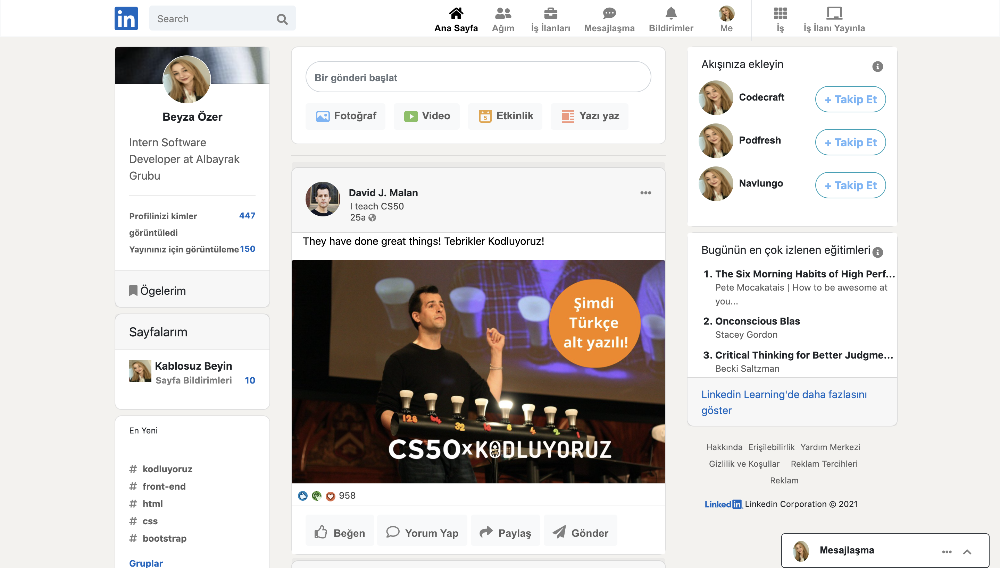
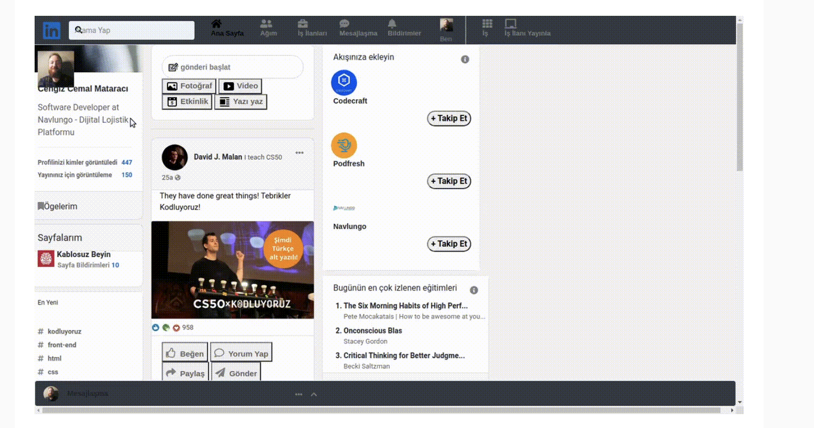

# Linkedin-Bootstrap-Clone

+ I maintained and developed a ready-made LinkedIn clone using bootstrap.



--------
+ This was the first version of the given Linkedin clone. And some adjustments to be made for this linkedin were said.

 

----- 
+ You can clone this project like this

`````
git clone https://github.com/beeyzaozer/Linkedin-Bootstrap-Clone.git

`````